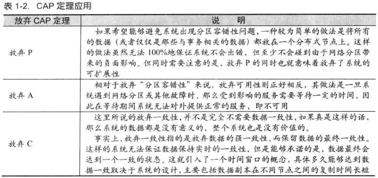

## 前言

## 从Paxos到ZooKeeper

<!-- more -->

### 第1章 分布式架构

#### 分布式的特点

- **分布性**：分布式系统中的多台计算机都会在空间上随意分布。
- **对等性**：分布式系统中的计算机没有主／从之分， 既没有控制整个系统的主机，也没有被控 制的从机，组成分布式系统的所有计算机节点都是对等的。
- **并发性**：如果在并发场景下协调好共享资源
- **缺乏全局时钟**：在分布式系统中，很难定义两个事件究竟谁先谁后，原因就是因为分布式系统缺乏一个全局的时钟序列控制。 
- **故障总会发生**：组成分布式系统的所有计算机，都有可能发生任何形式的故障。

#### 分布式环境的各种问题

- 通信异常：分布式节点之间需要网络通信，网络通信就带来，比如延迟等异常情况
- 网络分区：组成分布式系统的所有节点，因为网络异常，导致一部分节点能通信，一部分节点不能通信，这个现象称之为网络分区，俗称为“脑裂”。
- 三态：分布式系统的每一次请求与响应，存在特有的“三态”，即成功、失败和超时。
- 节点故障：

#### 分布式事务

分布式事务场景下的数据一致性等问题

#### 关于CAP与BASE

关于CAP的应用，我们要知道，分布式系统无法同时满足这三个需求的。往往只能满足其中两项，关于这点，在书中有个表格，这里贴出来，需要的时候可以看看缺失其中一项的应用场景是什么：

另外，在分布式场景下，分区容错性（P）是一定要解决的，不然怎么称之为分布式系统？

##### 关于BASE

BASE是由Basically Available(基本可用)、Soft state（软状态）和Eventually consistend（最终一致性）这三个短语构成的。

来自EBAY工程师Dan Pritchett在2008年发布的一篇文章中提到的概念，笔者从ACM网站上下载了下来，有需要可以翻阅看看。

 [Introduce BASE different with ACID.pdf](324f2c0b\Introduce BASE different with ACID.pdf) 

原文文章连接：https://dl.acm.org/doi/10.1145/1394127.1394128

【备注】书中介绍了一下ACID背景以及带来的问题，通过引入交易转账的两张小表来阐述怎么做到最终一致性，以及最终一致性的目标。读者可以仔细看看，例子不难，对于理解最终一致性是很有帮助的。

BASE是对CAP中一致性和可用性权衡的结果，其来源于对大规模互联网系统分布式实践的总结，是基于CAP定理逐步演化而来的，其核心思想是：**即使无法做到强一致性(Strong consistency)，但每个应用都可以根据自身的业务特点，采用适当的方式来使系统达到最终一致性(Eventual consistency)。**

【备注】关于最终一致性，书中还介绍了五类主要的变种，分别是：

- 因果一致性（Causal consistency）
- 读己之所写（Read your writes）
- 会话一致性（Session consistency）
- 单调读一致性（Monotonic /ˌmänəˈtänik/ read consistency）
- 单调写一致性（Monotonic write consistency）

### 第2章 一致性协议

【备注】这个章节中介绍了三种经典的分布式一致性算法，分别是二段提交（2PC, Two-Phase Commit）、三段提交（3PC, Three-Phase Commit）以及大名鼎鼎的Paxos算法。

在介绍二、三段提交算法之前，书中引入了“段式”提交的核心理念：

当一个事务操作需要跨越多个分布式节点的时候， 为了保持事务处理的ACID特性， 就需要引入 一个称为 ＂协调者(Coordinator)" 的组件来统一调度所有分布式节点的执行逻辑， 这些被调度的分布式节点则被称为 “参与者” (Participant)。 **协调者负责调度参与者的行为，并最终决定这些参与者是否要把事务真正进行提交。** 

#### 2PC

PC, 是Two-Phase Commit的缩写， 即二阶段提交，是计算机网络尤其是在数据库领域内， 为了使基于分布式系统架构下的所有节点在进行事务处理过程中能够保持原子性和一致性而设计的一种算法。

【备注】你可能也听过另外一个二段：二段锁（2PL, Two-Phase Locking），这俩个是完全不同的东西哦。二段锁，是解决单机事务中的数据的一致性和隔离性而诞生的。而，二段提交是处理的分布式事务。

#### 3PC

#### Paxos

### 第3章 Paxos的工程实践

### 第4章 ZooKeeper与Paxos

### 第5章 使用ZooKeeper

### 第6章 ZooKeeper的典型应用场景

### 第7章 ZooKeeper技术内幕

### 第8章 ZooKeeper运维

